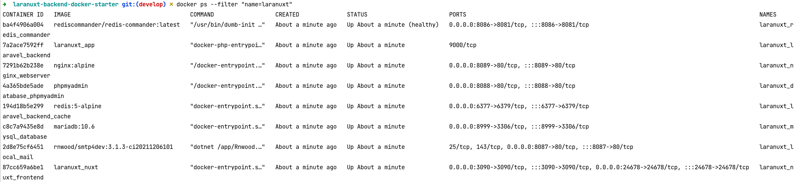

[Go Back](README.md)

## Installation

Please check the official laravel installation
guide. [Official Documentation](https://laravel.com/docs/11.x/installation)

Check and make sure you copied the `.env.example` to `.env` or it is already exists.

## Configure Docker

Change directory to the docker folder:

```bash
cd docker
```

Check if it has `.env` environment variables file already in place otherwise copy `.env.example` to create one `.env`

```bash
cp .env.example .env
```

Whatever is the MySQL credentials you used needs to be used on application directory `/.env` file accordingly.

If it is first time building docker container, run below command to Build images before starting containers.

```bash
docker-compose up --build
```

and with this command you are done with the setup and should be above to visit the app it's related services like,
phpmyadmin, redis commander, local smtp etc. Please refer to the bottom fo this page to see the visiting URLs.

## Accessing Container Shells

You can access the shells of various containers as needed to perform specific tasks:

### App Container (Laranuxt Backend)

To interact with the Laranuxt backend artisan and perform some initial setup tasks, enter into the app container with
the following command:

```bash
docker exec -it laranuxt_laravel_backend bash
```

Once inside the app container, anytime you can execute artisan commands like these:

- `composer install`
- `php artisan key:generate`
- `php artisan config:cache`
- `php artisan route:cache`
- `php artisan migrate`
- `php artisan db:seed`

### Web Server Container (Nginx)

To access the webserver container, use this command:

```bash
docker exec -it laranuxt_nginx_webserver /bin/sh
```

### MySQL Database Container

To access the MySQL container, use the following command:

```bash
docker exec -it laranuxt_nginx_webserver /bin/sh
```

**Example**: You may need to copy the database later from outside of the container to import it:

```bash
docker cp ~/Desktop/staging/database.sql laranuxt_mysql_database:/root/database.sql
```

Then, log in to MySQL and import the database:

```bash
mysql -u root -p   
show databases;   
mysql -u root -p PASSWORD < /root/database.sql   
```

### Redis Cache Container

To access the Redis cache instance container, run:

```bash
docker exec -it laranuxt_laravel_backend_cache /bin/sh 
```

Once inside, you can use the redis-cli tool to run Redis commands. The basic syntax includes:

- `redis-cli`
- `SET key value [expiration EX seconds|PX milliseconds] [NX|XX]`
- `GET key`

### Verifying Initial Setup

If you are successfully done the initial setup, you should see all the containers running.



## Some useful docker commands

- `docker ps` - List all running containers.
- `docker ps --filter "name=laranuxt"` - List running containers filtered by name.
- `docker stop container-name` - Stop a running container gracefully.
- `docker kill container-name` - Forcefully stop a running container.
- `docker restart container-name` - Restart a container.
- `docker rm container-name` - Remove a stopped container.
- `docker cp ~/Desktop/staging/database.sql laranuxt_mysql_database:/root/database.sql` - Copying a database inside MySQL container to import it from inside the container later.
- `docker system prune -a` - Removes all unused images, containers, networks, and dangling data.
- `docker ps -a --filter "name=laranuxt_"` - List all the containers prefixed with "laranuxt_".
- `docker stop $(docker ps -q --filter "name=laranuxt_")` - Stops all running containers with names starting with "laranuxt_".
- `docker rm $(docker ps -a -q --filter "name=laranuxt_")` - Removes all stopped containers with names starting with "laranuxt_".
- `docker rm -f $(docker ps -a -q --filter "name=laranuxt_")` - Forces the removal of all containers (including running ones) with names starting with "laranuxt_".

## Stop all running container of the project

```bash
docker-compose down
```

## Visit different container on browser

- [Application](http://127.0.0.1:8281)
- [PHPMyAdmin](http://127.0.0.1:8282)
- [Redis Commander](http://127.0.0.1:8283)
- [Local SMTP4DEV](http://127.0.0.1:8284)

### Documentation & Collaborations

- [GitHub](https://github.com/phpfarmer/laranuxt-backend-docker-starter)
