[Go Back](README.md)

## Screenshots

**Note:** You must have [Laranuxt Frontend](https://github.com/phpfarmer/laranuxt-frontend-docker-starter) application
up and running with correct port setup to get it all working!

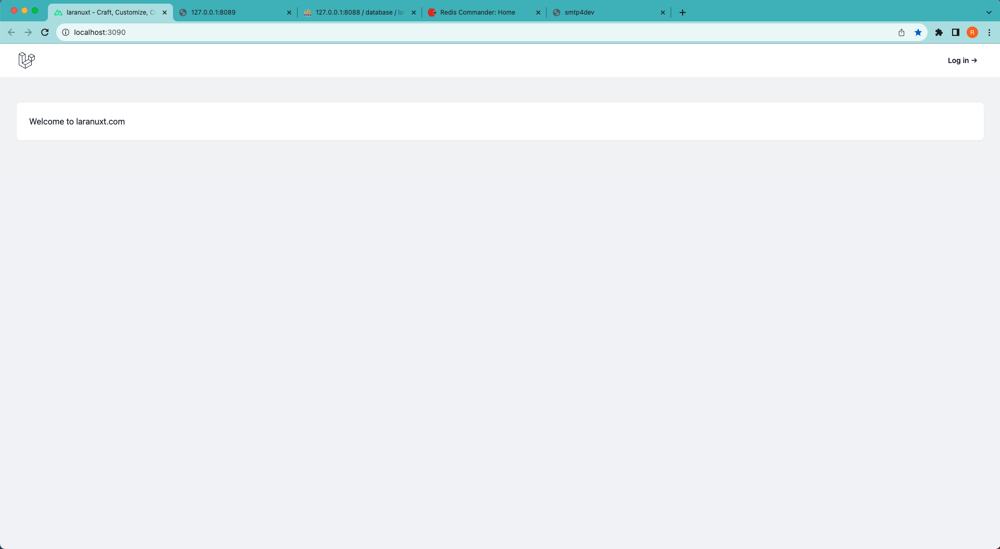
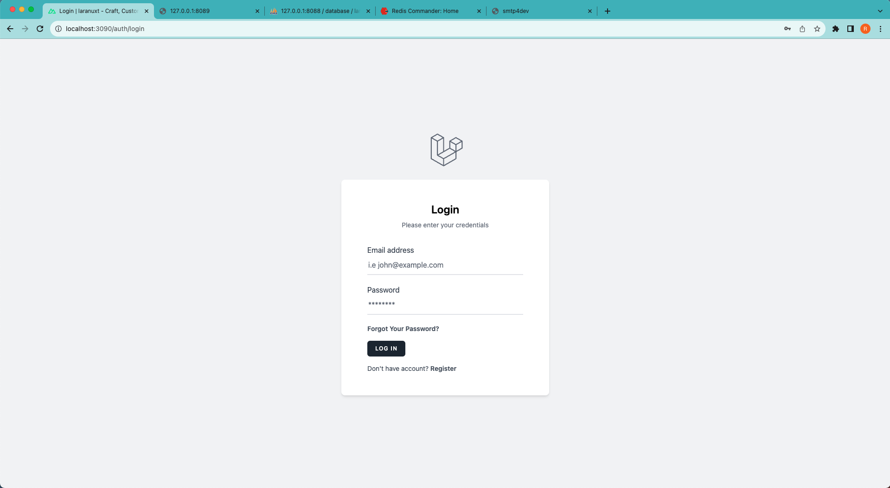
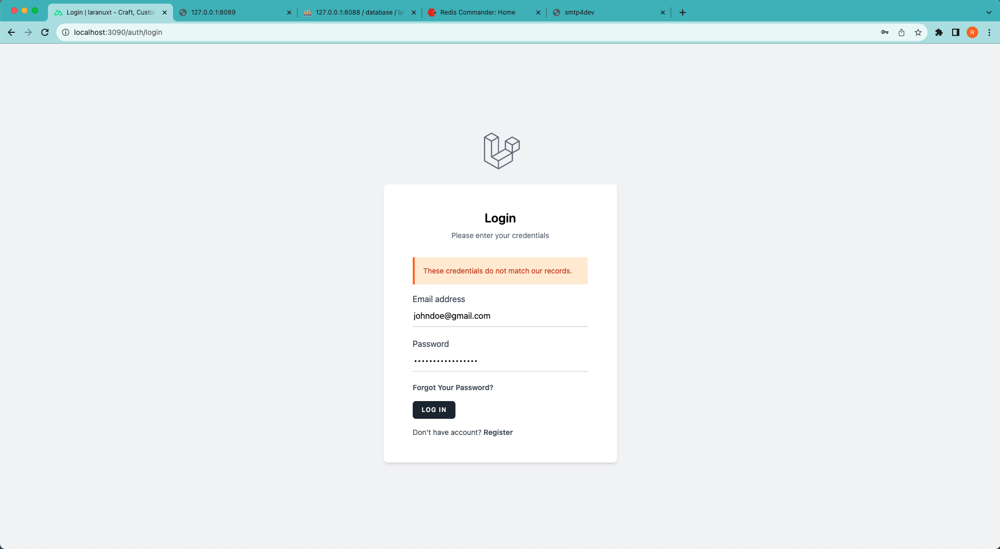
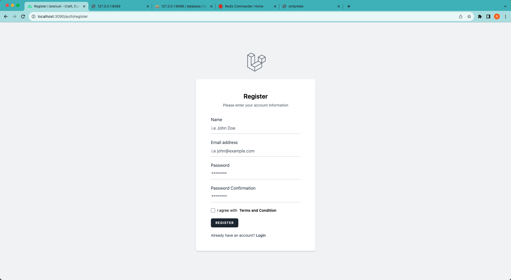
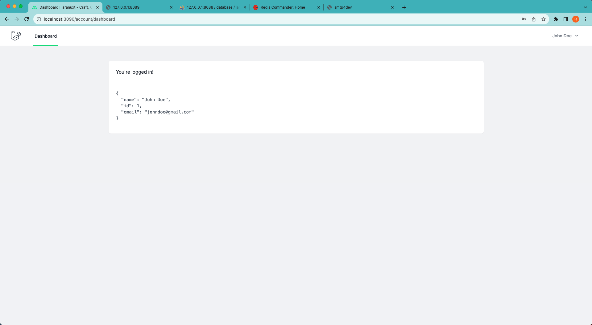
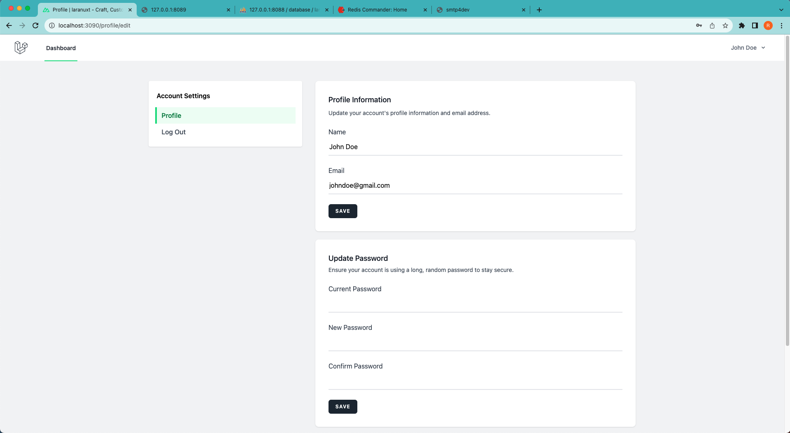
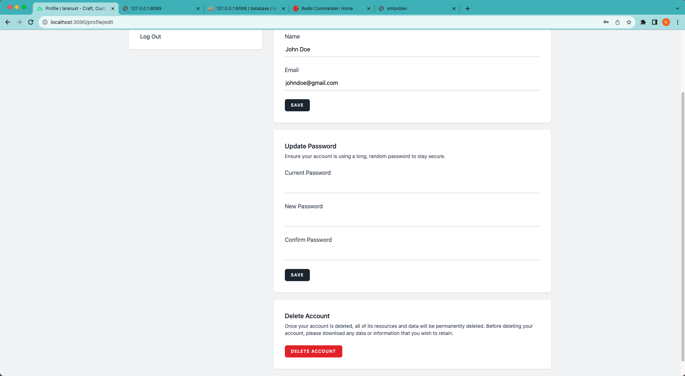
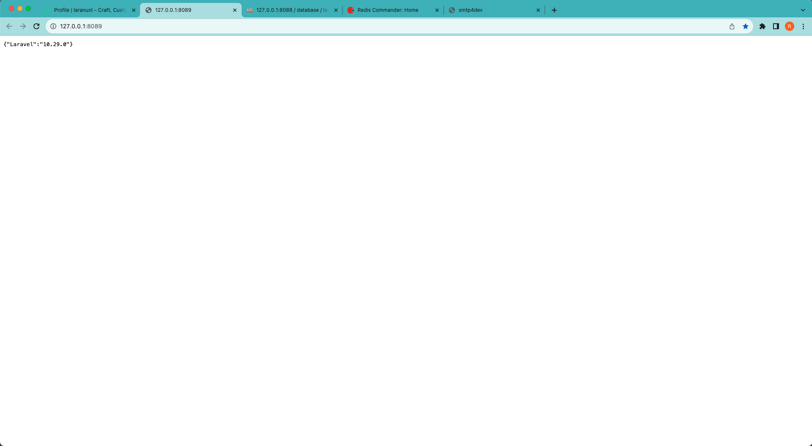
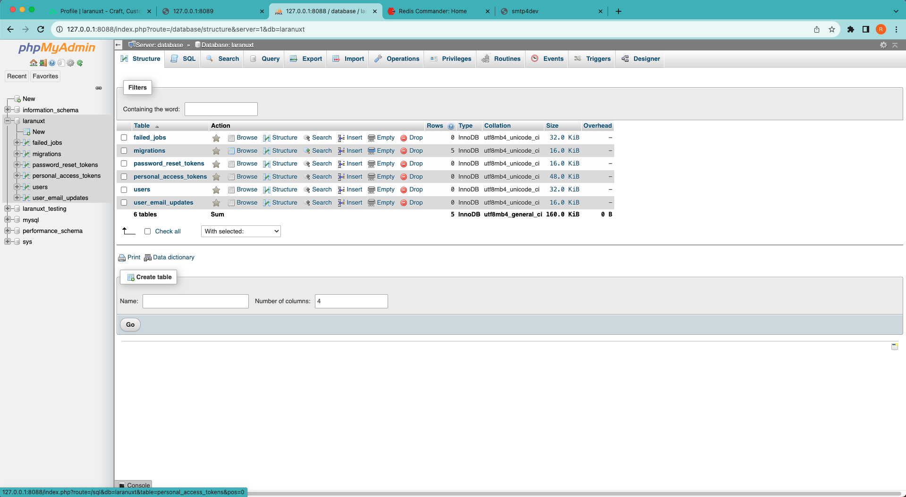
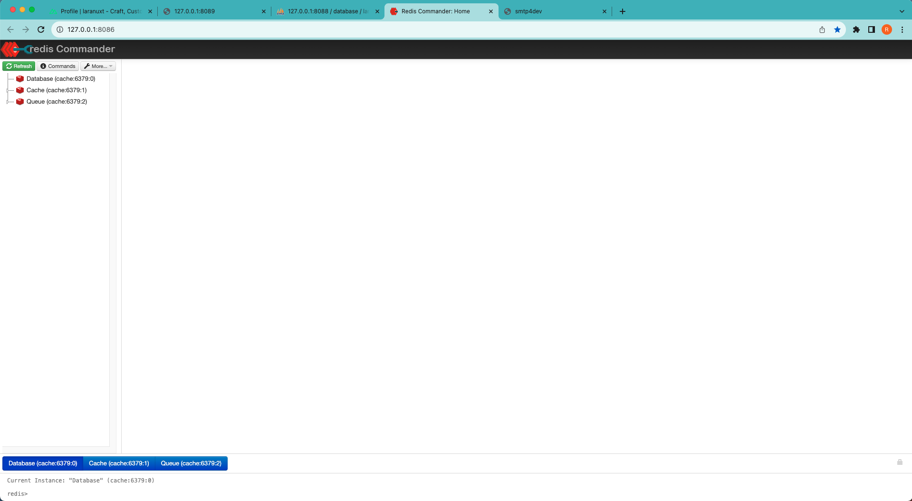
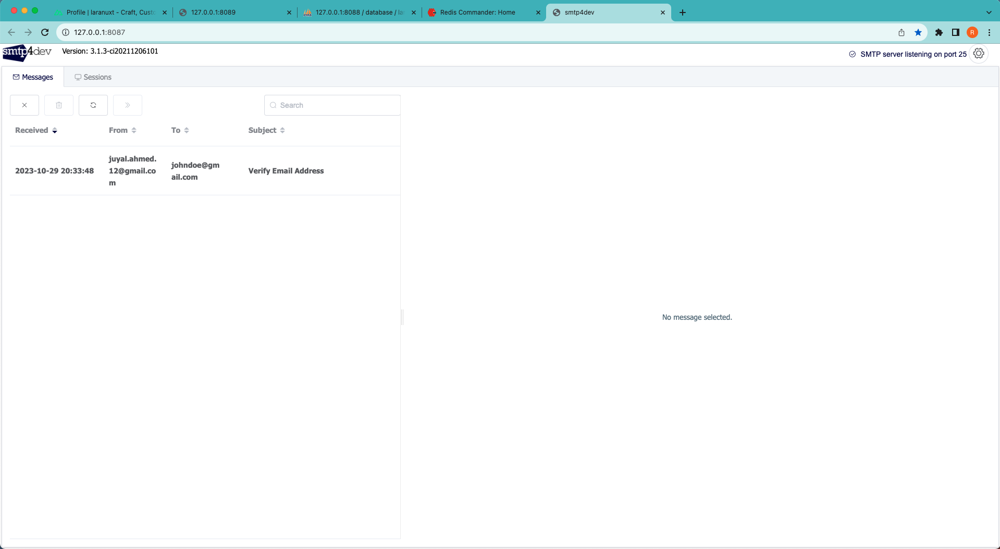
