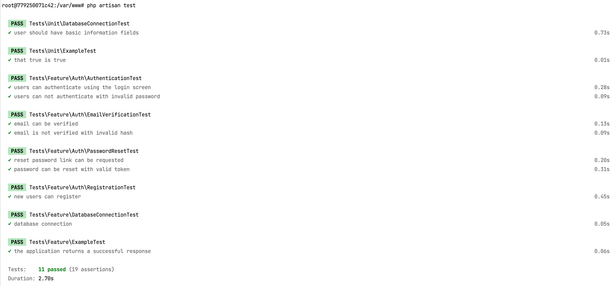

[Go Back](README.md)

## Testing via PHPUnit

You can check the official laravel testing guide here. [Database Testing](https://laravel.com/docs/10.x/testing)

I've put the `.env.testing.example` file intentionally so that you can just use it, just make sure you have created a
testing database and updated this `.env.testing.example` file properly.

Run the automated testing

    docker exec -it laranuxt_laravel_backend vendor/bin/phpunit

## Run Test from Inside docker container

If your setup is based on Docker container, you can get inside the container first and run the test command

    docker exec -it laranuxt_laravel_backend bash
    php artisan test
    php artisan test --coverage-html=build/coverage

It supposed to show you at least `x tests, x assertions` which has Unit and Feature tests all together as shown on below
screenshot.

## Run Tests with Code Coverage

When running your application tests, you may want to determine whether your test cases are actually covering the
application code and how much application code is used when running your tests. To accomplish this, you may provide
the `--coverage` option when invoking the `test` command:

    php artisan test --coverage
    php artisan test --coverage-html=build/coverage

### Enforcing A Minimum Coverage Threshold

You may use the `--min` option to define a minimum test coverage threshold for your application. The test suite will
fail if this threshold is not met:

    php artisan test --coverage --min=80.3

### Running from outside of docker container

    docker exec -it laranuxt_laravel_backend /var/www/artisan test --coverage

Example Output:

If you build coverage html which can be found in: /build/coverage/index.html and open in a browser to see the output
there.
[Example Coverage Dashboard](Coverage.md)

### Profiling Tests

The Artisan test runner also includes a convenient mechanism for listing your application's slowest tests. Invoke the
test command with the `--profile` option to be presented with a list of your ten slowest tests, allowing you to easily
investigate which tests can be improved to speed up your test suite:

    docker exec -it laranuxt_laravel_backend /var/www/artisan test --profile

Example Output:

